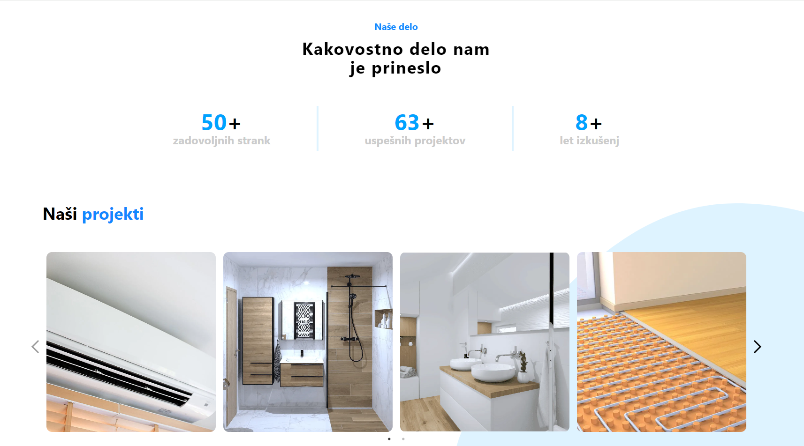
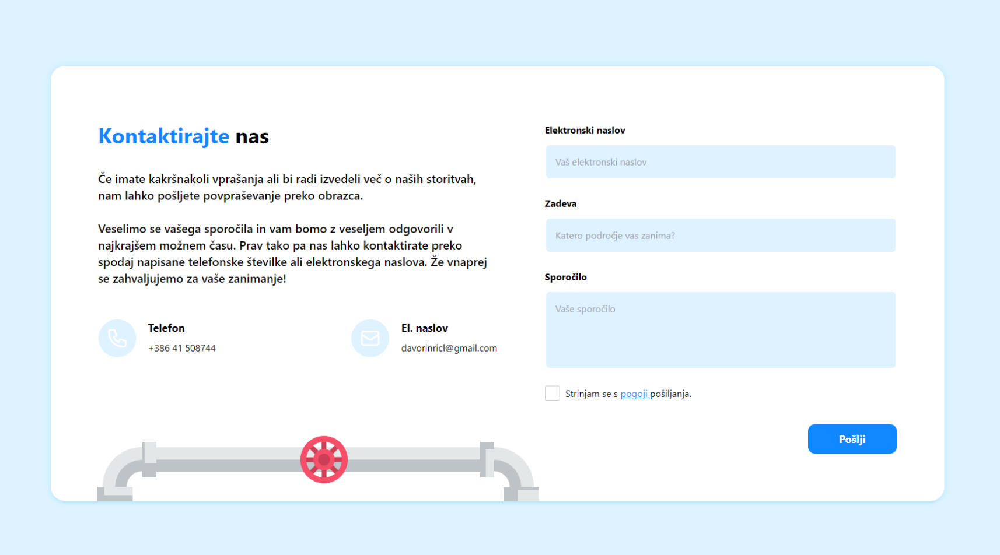

# Strojne inštalacije Ričl

Strojne inštalacije Ričl is a modern and user-friendly website dedicated to showcasing the services of a small craftsman
specializing in mechanical installations and plumbing. The team offers comprehensive solutions for homes and business
premises, including tile installation, bathroom renovations, underfloor heating, air conditioning installation, pipe
laying, and heat pump installation. Whether minor repairs or major renovations are needed, they are ready to help
realize projects with quality and reliability

Key Features:

- Project Gallery: A comprehensive view of all completed projects, demonstrating quality and craftsmanship.
- Service Overview: Descriptions of the services offered.
- Customer Reviews: Testimonials and feedback from satisfied clients.
- Contact Form: An easy-to-use contact form for quick and efficient communication.
-

## Web Application

<div style="display: grid; grid-template-columns: 1fr 1fr; gap: 5px">
  
  
  
  
</div>

Live preview: [Strojne inštalacije Ričl](https://strojne-instalacije-ricl.vercel.app/)

## Technologies

- [Next.js](https://nextjs.org/)
- [TypeScript](https://www.typescriptlang.org/)
- [Tailwind CSS](https://tailwindcss.com/)
- [Prisma](https://www.prisma.io/)
- [Recaptcha](https://www.google.com/recaptcha/about/)

## Getting Started

Install dependencies:

```bash
npm install
```

Run the development server:

```bash
npm run dev
```
